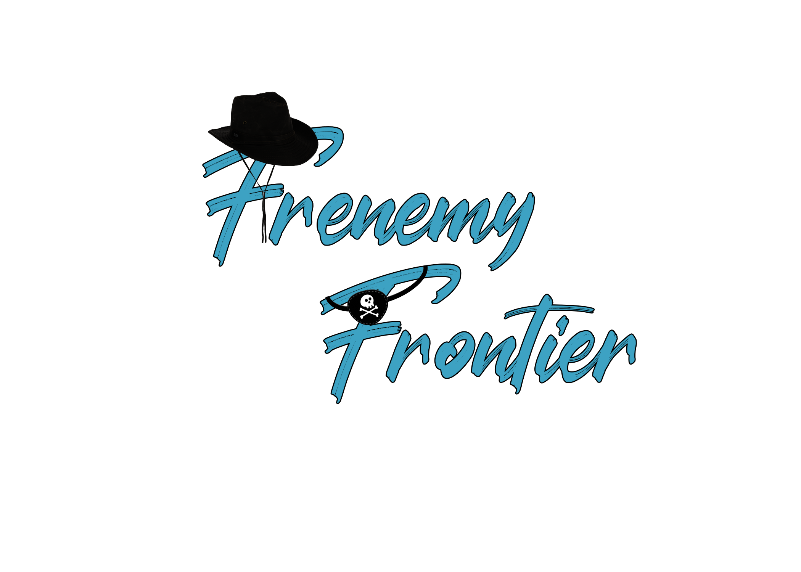

<!-- Improved compatibility of back to top link: See: https://github.com/othneildrew/Best-README-Template/pull/73 -->

<!--
*** Thanks for checking out the Best-README-Template. If you have a suggestion
*** that would make this better, please fork the repo and create a pull request
*** or simply open an issue with the tag "enhancement".
*** Don't forget to give the project a star!
*** Thanks again! Now go create something AMAZING! :D
-->

<!-- PROJECT SHIELDS -->
<!--
*** I'm using markdown "reference style" links for readability.
*** Reference links are enclosed in brackets [ ] instead of parentheses ( ).
*** See the bottom of this document for the declaration of the reference variables
*** for contributors-url, forks-url, etc. This is an optional, concise syntax you may use.
*** https://www.markdownguide.org/basic-syntax/#reference-style-links
-->

    

<!-- PROJECT LOGO -->
 

  <h3 align="center">Frenmey Frontier</h3>
  

   Frenemy Frontier is a 4 player online multiplayer game based on a bounty hunting theme, it has both cooperative and competitive mechanics, You can play as a bounty hunter or a criminal, While the game encourages players to work together, it ultimately results in one person winning, creating an environment of competition.
     
    

    <a href="https://www.youtube.com/watch?v=_Tr9U8EX-OM" target="_blank">Trailer</a>
    

  

<!-- TABLE OF CONTENTS -->

  
Table of Contents

  <ol>
    <li>
      <a href="#about-the-project">About The Project</a>
      <ul>
        <li><a href="#built-with">Built With</a></li>
      </ul>
    </li>
    <li>
      <a href="#getting-started">Getting Started</a>
      <ul>
        <li><a href="#prerequisites">Prerequisites</a></li>
        <li><a href="#installation">Installation</a></li>
      </ul>
    </li>
    <li><a href="#contact">Contact</a></li>
    <li><a href="#acknowledgments">Acknowledgments</a></li>
  </ol>

<!-- ABOUT THE PROJECT -->
## About The Project

### Online Multiplayer Lobby
The game allows players to create their own room, or join an existing room in the lobby menu.
In the current version of the game, players can join a room by just clicking on the room’s name label. Each room hosts
four players. Once all four players join the room, the players can select their role and avatar. The
player who created the room is assigned the role of master client and only that player can start the game once all the
players have selected their roles and avatars.
### Bounty hunters game-play Loop
When the game begins the bounty hunters are spawned into the map at fixed spawn points. They have access to the visual description and current bounty of each
criminal. Bounty hunters can use this information to start their search for the criminals. Once they
are able to locate a criminal, they have to try and damage the criminal until they see a red mark on their head. Then they can capture the criminal and take them to the police station which will reward them with the full
bounty of the criminal. If they fail to capture them but instead succeed in killing the criminal then they get half of the
total bounty as a reward. If they die during combat they will be re-spawned into the map at a random location and they
will lose any weapon they were holding.
### Criminals game-play Loop
When the game begins the Criminals are spawned into the map. They have access to the location of the treasures on the mini-map, using this information they can start collecting the treasure. For each treasure they collect they get 5,000 coins
and a bounty of 2,500 is added as well. Ideally, criminals are expected to avoid combat with Bounty hunters, however,
if a criminal kills a bounty hunter then a bounty of 10,000 will be added to their current bounty. If a criminal gets
captured and is put in jail then they will re-spawn after a 10-second delay and lose coins equivalent to their current
bounty. If they have a larger bounty than their coins, then they will lose all of their coins, and the bounty is reset to
500. Criminals can defeat the capturing Bounty hunter to free their teammate, or if the Bounty hunter fails to carry the
Criminal to Jail within 30 seconds then their health is set to 50% and they are free to continue.
### Rules and Win Condition
Frenemy Frontier has a countdown timer of 5 minutes. This timer starts as soon as the master
client selects the start game button in the lobby scene. As criminals collect the treasure and get coins, a meter on the
bottom screen fills up (this indicates the sum total of coins collected by both of the criminals). If the
meter remains full (in the current version of the game maximum range of the meter is 20,000 coins) when the timer
reaches zero, then the criminal’s win condition is met and the criminal holding the maximum coins is designated as
the winner. If, however, the meter is not full when the timer reaches zero, then the bounty hunter’s win condition is
met and the bounty hunter with the highest bounty collected is designated as the winner

### Built With

Major frameworks/libraries used to bootstrap the project.

* Unity 2021.3.16f1

### Prerequisites

* Windows 10+
* Unity 2021+

### Installation

1. Clone the repo

2. Open Project in Unity

3. Play the Project inside Unity or Make a Build

4. The project requires 4 players, so share the build file with your friends and create a room for them.

5. Enjoy!

<!-- CONTACT -->
## Contact

* Abhinav Chitty - abhinavreddy1925@gmail.com
* [![LinkedIn][linkedin-shield]][linkedin-url]
* [![Portfolio][portfolioIcon-url]][portfolio-url]
* 
* Siddharth Singhai - sidsinghai97@gmail.com
* [![LinkedIn][linkedin-shield]][linkedin-url2]
* [![Portfolio][portfolioIcon-url]][portfolio-url2]

<!-- MARKDOWN LINKS & IMAGES -->
<!-- https://www.markdownguide.org/basic-syntax/#reference-style-links -->
[linkedin-shield]: https://img.shields.io/badge/-LinkedIn-black.svg?style=for-the-badge&logo=linkedin&colorB=555
[linkedin-url]: https://www.linkedin.com/in/abhinav-chitty-16a341152/
[portfolioIcon-url]: https://img.shields.io/badge/-Portfolio-brightgreen
[portfolio-url]: https://chittya.myportfolio.com/
[linkedin-url2]: https://www.linkedin.com/in/siddharthsinghai97/
[portfolio-url2]: https://sidsinghai97.wixsite.com/portfolio
